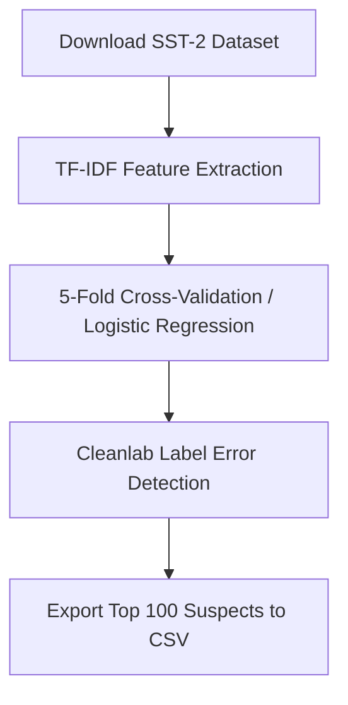

# Human-Annotated vs. Synthetic Dataset Comparison Analysis (FYDP MVP)

This repository hosts the **Final Year Design Project (FYDP) MVP** for analyzing and auditing datasets to compare human annotations with synthetic data generation quality.

Specifically, this phase implements a **Systematic Dataset Audit Pipeline** targeting the popular **SST-2 (Stanford Sentiment Treebank)** dataset to identify and export label noise/errors, which is then compared against synthetic sentiment datasets.

---

## 🚀 Pipeline Workflow

The dataset audit follows a 5-step methodology implemented in [sst2_audit_mvp.py](file:///c:/Users/msbor/OneDrive/Desktop/FYDP%20MVP/sst2_audit_mvp.py):



1. **Dataset Download**: Automatically fetches the SST-2 train split from Hugging Face's GLUE benchmark.
2. **Feature Extraction**: Vectorizes text inputs using a TF-IDF Vectorizer (limited to 5,000 features for optimal runtime).
3. **Out-of-Fold Probabilities**: Trains a Logistic Regression classifier under a 5-fold cross-validation scheme to predict sentiment probabilities without overfitting.
4. **Cleanlab Analysis**: Employs `cleanlab.filter.find_label_issues` to find label issues, ranked by self-confidence.
5. **Validation Export**: Generates a CSV file containing the top 100 suspected label errors with empty reviewer fields for team consensus.

---

## 📁 Repository Structure

* 📂 **`dataset/`**:
  * 📊 **[synth_data.csv](file:///c:/Users/msbor/OneDrive/Desktop/FYDP%20MVP/dataset/synth_data.csv)**: A synthetic dataset containing 1,000 generated sentiment sentences with positive (`1`) and negative (`0`) labels, used for comparing quality, variance, and error rates against human-annotated datasets.
* 📄 **[sst2_audit_mvp.py](file:///c:/Users/msbor/OneDrive/Desktop/FYDP%20MVP/sst2_audit_mvp.py)**: The main Python pipeline containing download, training, cleanlab analysis, and CSV generation logic.
* 📊 **[SST2_Top_100_Suspects.csv](file:///c:/Users/msbor/OneDrive/Desktop/FYDP%20MVP/SST2_Top_100_Suspects.csv)**: Output list of the top 100 suspected label errors for manual review. Includes review fields:
  * `Team_Corrected_Label` (for consensus label)
  * `Error_Type` (e.g., sarcasm, ambiguous, clear error)
  * `Notes`
* 📝 **[requirements.txt](file:///c:/Users/msbor/OneDrive/Desktop/FYDP%20MVP/requirements.txt)**: List of Python packages required to run the pipeline.
* 📘 **Phase 1_ Systematic Dataset Audit Execution Plan V2.docx**: Detailed execution plan and methodology documentation.

---

## 🛠️ Setup and Installation

### 1. Clone & Navigate
```bash
git clone https://github.com/sadekinborno/Human-Annotated-Dataset-vs-Synthetic-Dataset-Comparison-Analysis.git
cd Human-Annotated-Dataset-vs-Synthetic-Dataset-Comparison-Analysis
```

### 2. Environment Configuration
It is recommended to use a Python virtual environment:
```bash
# Create environment
python -m venv venv

# Activate environment (Windows PowerShell)
.\venv\Scripts\Activate.ps1

# Activate environment (Bash/macOS/Linux)
source venv/bin/activate
```

### 3. Install Dependencies
```bash
pip install -r requirements.txt
```

---

## 💻 Running the Audit Pipeline

Execute the MVP script using:
```bash
python sst2_audit_mvp.py
```

This will output diagnostic logs to the terminal and overwrite or create the target suspect list: [SST2_Top_100_Suspects.csv](file:///c:/Users/msbor/OneDrive/Desktop/FYDP%20MVP/SST2_Top_100_Suspects.csv).

---

## 🔍 Examples of Identified Label Issues (Human-Annotated SST-2)

Below are examples of suspected labels highlighted by the tool:
* *"even at its worst , it 's not half-bad ."*
  * **Given Label**: `1` (Positive)
  * **Status**: Highly ambiguous or double negation which standard models struggle with.
* *"not all that bad of a movie"*
  * **Given Label**: `1` (Positive)
  * **Cleanlab Flag**: Marked as highly suspected due to double negatives.
