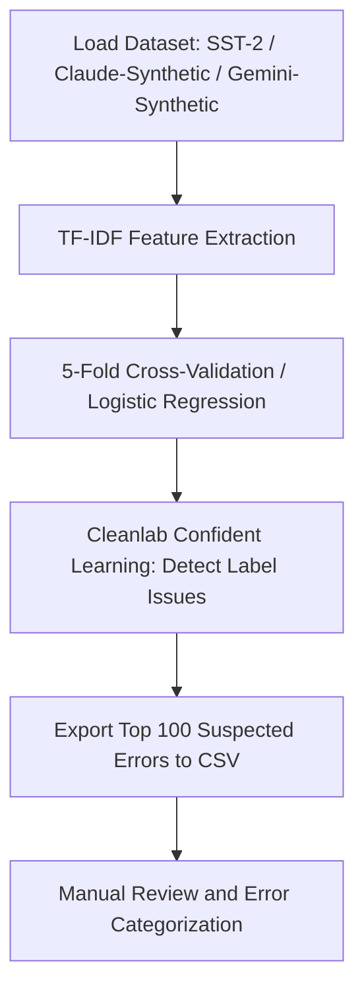

# Comparative Analysis of Human-Annotated vs. Synthetic Datasets in Sentiment Analysis

A dataset-auditing pipeline that flags and reviews label-quality issues across three sentiment classification datasets — the human-annotated SST-2 benchmark, and two LLM-generated synthetic datasets (Claude and Gemini).


## Overview

The pipeline (`sst2_audit_mvp.py`) uses TF-IDF features, a 5-fold cross-validated logistic regression model, and the Cleanlab confident-learning framework to flag the samples in a dataset most likely to be mislabeled. The same pipeline is run independently on each of the three datasets below, and flagged samples are manually reviewed by the team to confirm or reject each suspected error.

## Datasets

1. **SST-2 (Stanford Sentiment Treebank)** — Human-annotated binary sentiment benchmark. Source: [huggingface.co/datasets/stanfordnlp/sst2](https://huggingface.co/datasets/stanfordnlp/sst2)
2. **Synthetic Dataset (Claude)** — 2,000 sentiment-labeled sentences generated using Anthropic's Claude LLM. File: `dataset/synth_data.csv`
3. **Synthetic Dataset (Gemini)** — Comparable synthetic dataset generated using Google's Gemini LLM. File: `dataset/synth_data_2000.csv`

## Pipeline Steps



1. **TF-IDF Feature Extraction** — Converts raw text into numerical vectors (capped at 5,000 features).
2. **Cross-Validated Training** — Logistic regression trained under 5-fold CV to produce out-of-fold predicted probabilities.
3. **Cleanlab Analysis** — `find_label_issues` flags samples where model confidence conflicts with the assigned label.
4. **Export** — Top 100 flagged samples per dataset written to CSV for manual review.
5. **Manual Review** — Each flagged sample is checked by hand and, if confirmed as an error, tagged as one of: `Context Stripping`, `Objective Mislabeling`, or `Ambiguous`.

## Repository Structure

| File / Folder | Description |
|---|---|
| `sst2_audit_mvp.py` | Main pipeline script — loads a dataset, runs TF-IDF + CV training, runs Cleanlab, exports the suspect CSV. Run this to reproduce the audit for any of the three datasets. |
| `dataset/synth_data.csv` | Claude-generated synthetic dataset (2,000 samples). |
| `dataset/synth_data_2000.csv` | Gemini-generated synthetic dataset. |
| `SST2_Top_100_Suspects.csv` | Output of the pipeline run on SST-2 — the 100 most suspicious samples, with empty `Team_Corrected_Label`, `Error_Type`, and `Notes` columns filled in during manual review. |
| `requirements.txt` | Python dependencies needed to run `sst2_audit_mvp.py`. |
| `Phase 1_ Systematic Dataset Audit Execution Plan V2.docx` | Original execution plan / methodology write-up used to scope the project. |
| `Data_Mining_Report.pdf` | Final submitted report — abstract, full methodology, results, and analysis for all three datasets. **Read this for the actual findings.** |

## Setup and Installation

```bash
git clone https://github.com/sadekinborno/Human-Annotated-Dataset-vs-Synthetic-Dataset-Comparison-Analysis.git
cd Human-Annotated-Dataset-vs-Synthetic-Dataset-Comparison-Analysis

python -m venv venv
# Windows (PowerShell): .\venv\Scripts\Activate.ps1
# macOS / Linux:        source venv/bin/activate

pip install -r requirements.txt
```

## Running the Pipeline

```bash
## 💻 Running the Audit Pipeline

Execute the MVP script using:
```bash
python sst2_audit_mvp.py
```

This will output diagnostic logs to the terminal and overwrite or create the target suspect list: [SST2_Top_100_Suspects.csv](file:///c:/Users/msbor/OneDrive/Desktop/FYDP%20MVP/SST2_Top_100_Suspects.csv).

## 🔍 Examples of Identified Label Issues (Human-Annotated SST-2)

Below are examples of suspected labels highlighted by the tool:
* *"even at its worst , it 's not half-bad ."*
  * **Given Label**: `1` (Positive)
  * **Status**: Highly ambiguous or double negation which standard models struggle with.
* *"not all that bad of a movie"*
  * **Given Label**: `1` (Positive)
  * **Cleanlab Flag**: Marked as highly suspected due to double negatives.