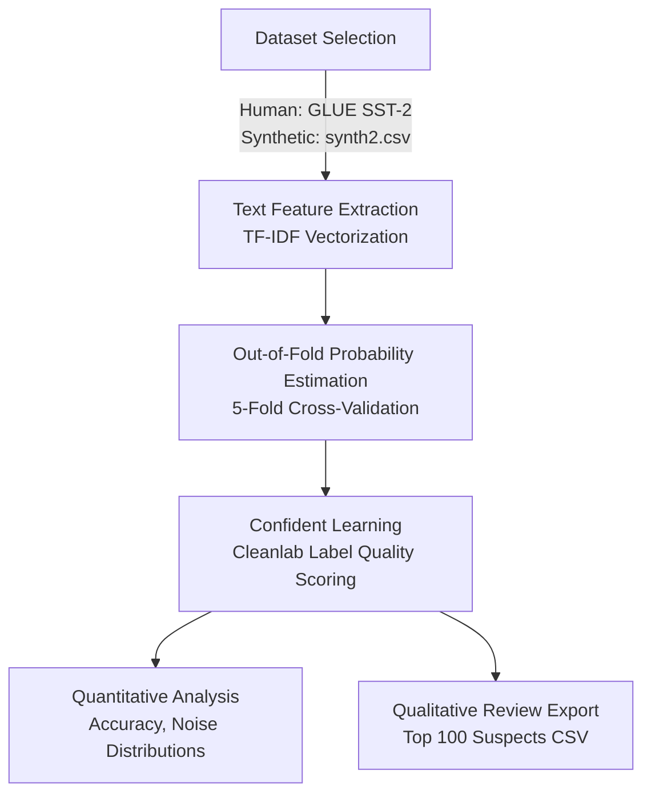

# Project Methodology: Comparative Analysis of Human-Annotated vs. LLM-Generated Synthetic Datasets

This report details the methodology employed to audit and compare the quality, noise level, and semantic consistency of a human-annotated sentiment dataset against an LLM-generated synthetic sentiment dataset.

---

## 1. Overview of the Methodology
The methodology uses a combination of natural language processing (NLP), machine learning cross-validation, and confident learning (Cleanlab) to identify and quantify label issues in both human and synthetic datasets.

The high-level pipeline for both datasets is structured as follows:

---

## 2. Step-by-Step Execution Pipeline

### Phase A: Dataset Selection & Preparation
Two datasets were prepared for comparative sentiment classification (binary classification: `0` = Negative, `1` = Positive):
1. **Human-Annotated Dataset**: The training split of the **SST-2 (Stanford Sentiment Treebank)** dataset from the GLUE benchmark. This dataset represents traditional, crowdsourced human labels which are prone to cognitive fatigue, subjectivity, and ambiguity.
2. **Synthetic Dataset (`synth2.csv`)**: A collection of 2,000 sentiment review sentences generated by a Large Language Model (LLM) with corresponding labels. This dataset represents LLM-generated outputs, which tend to be grammatically clean but may contain model-specific biases or repetitive phrasing templates.

### Phase B: Text Feature Extraction
To train a baseline classifier, text inputs must be converted into numerical vector representations. 
* We utilize **TF-IDF (Term Frequency-Inverse Document Frequency)** vectorization:
  $$TF\text{-}IDF(t, d, D) = TF(t, d) \times IDF(t, D)$$
* To focus on content words and prevent overfitting on noise, the vocabulary is limited to the top **5,000 features** and filtered using a standard **English stop words** list.

### Phase C: Out-of-Fold Probability Estimation
A standard classifier is trained to estimate the probability distribution over classes for each sample. 
1. We employ a **Logistic Regression** model (optimized via L2 regularization and `lbfgs` solver).
2. To obtain unbiased prediction probabilities for every sample without training on the same data points, we execute a **5-fold Cross-Validation** scheme (`cross_val_predict`).
3. For each data point $x_i$, this yields an out-of-fold probability vector $P(y_i = c \mid x_i)$ for all classes $c \in \{0, 1\}$.

### Phase D: Confident Learning (Label Noise Detection)
To identify label errors without assuming the classifier itself is perfectly accurate, we apply **Confident Learning (CL)** principles using the `cleanlab` library:
* **Confident Joint**: Estimating the joint distribution of given noisy labels $y$ and latent true labels $y^*$. A sample is flagged if its given label $y_i$ is highly inconsistent with its out-of-fold predicted probability distribution.
* **Label Quality Scores**: We calculate a continuous self-confidence score for each sample. The self-confidence score for a sample $i$ with given label $y_i = c$ is defined as the predicted probability of that given label:
  $$\text{Score}_i = P(y_i = c \mid x_i)$$
  A lower score indicates a higher likelihood that the given label is incorrect or highly ambiguous.

### Phase E: Comparative Metric Evaluation
To compare the human-annotated dataset against the LLM-generated synthetic dataset, we analyze the following metrics:
1. **Baseline Cross-Validation Accuracy**:
   $$\text{Accuracy} = \frac{1}{N} \sum_{i=1}^{N} \mathbb{I}(\hat{y}_i = y_i)$$
   Where $\hat{y}_i = \operatorname{argmax}_c P(y_i = c \mid x_i)$ and $y_i$ is the given label. 
   * *Hypothesis*: Synthetic datasets will exhibit higher classification accuracy (~99%) due to structured templates and lower linguistic variance, while human datasets will show lower accuracy (~85-90%) due to linguistic complexity (sarcasm, idioms, double negatives) and human label noise.
2. **Label Quality Score Distribution**: The frequency and density of samples falling below key quality thresholds (e.g., $\text{Score} < 0.5$).
3. **Top 100 Ranked Suspects**: Exporting the 100 samples with the lowest label quality scores to a CSV structure:
   $$\text{Suspects} = \operatorname{sort\_ascending}(\{\text{Score}_i\})_{1..100}$$
   These are annotated with columns (`Team_Corrected_Label`, `Error_Type`, `Notes`) for manual audit.

---

## 3. Human-in-the-Loop Validation (Qualitative Audit)
To ground the quantitative findings, a human review phase is integrated into the methodology:
* Reviewers inspect the exported CSV files (`SST2_Top_100_Suspects.csv` and `synth2_top_100_suspects.csv`).
* Each flagged error is categorized into specific noise typologies:
  * **Systematic Error**: The generator consistently flipped labels (e.g. interpreting negative sarcasm as positive).
  * **Semantic Ambiguity**: The text contains balanced mixed sentiments (e.g., "visually stunning but emotionally barren") where either label could be valid.
  * **True Annotator Error**: The given label is flatly incorrect.
